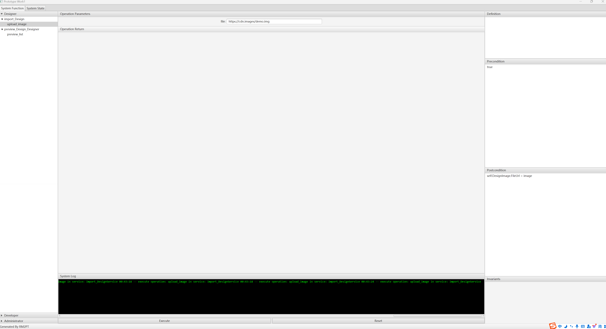

# 设计转代码系统
## 项目概述
本系统为设计师和开发者提供协作平台，主要功能包括：

1. 设计师可上传和预览设计稿

2. 开发者可将设计稿导出并转换为代码

3. 为不同角色提供专属视图

## 建模成果
### 用户故事

### 用例图

### 系统类图

### 需求原型化截图

## 模型规模统计
|  指标项  |  数量  |
|  ----  | ----  |
|  自然语言需求  |  8个用户需求、15个系统需求  |
|  参与者  |  2个(设计师、开发者)  |
|  用例	 |  7个(导入、多种预览、导出等)  |
|  系统顺序图  |  7个(每个用例对应一个)  |
|  系统操作  |  9个(跨所有服务)  |
|  系统合约数量  |  8个(除共享预览外每个操作一个)  |
|  类数量 |  9个(设计师、开发者、设计图像等)  |

## 原型化成果
设计师界面截图
设计师界面
展示设计师的设计上传和预览功能

开发者界面截图
开发者界面
展示代码导出选项和开发预览功能

## 核心功能实现
### 角色专属视图

1. 设计师查看创意素材和版本

2. 开发者查看可转换代码和转换状态
